# Gripper Descriptions

Real-world gripper URDF descriptions, meshes, and configuration files for [GraspGenX](https://github.com/NVlabs/GraspGenX).

## Supported Grippers

<table align="center">
  <tr>
    <td align="center">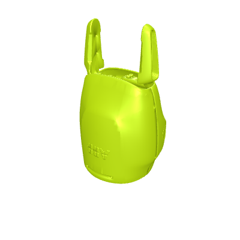<br><code>abb_yumi</code><br><sub>parallel_2f</sub></td>
    <td align="center">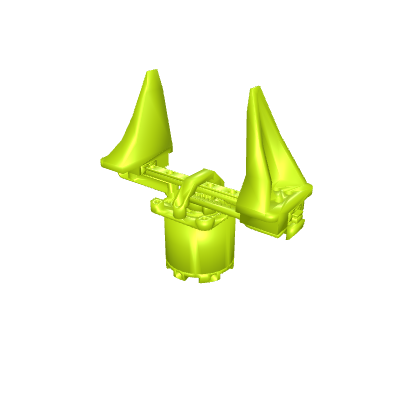<br><code>arx_x5</code><br><sub>revolute_2f</sub></td>
    <td align="center">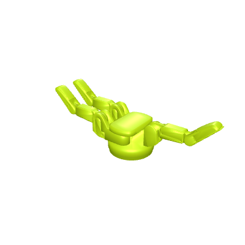<br><code>barrett_hand</code><br><sub>revolute_3f</sub></td>
    <td align="center">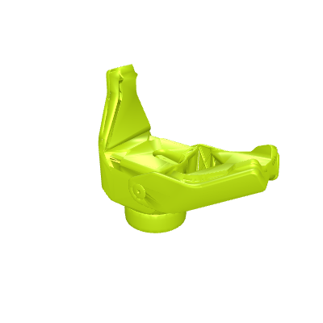<br><code>bd_spot</code><br><sub>revolute_2f</sub></td>
    <td align="center">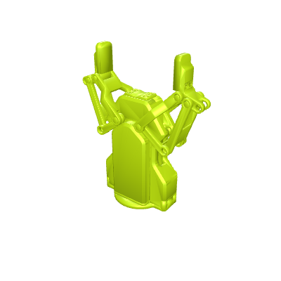<br><code>dh_ag95</code><br><sub>parallel_2f</sub></td>
    <td align="center">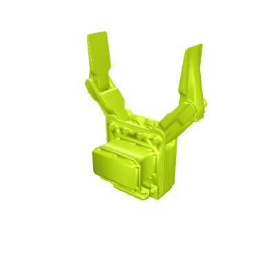<br><code>ezgripper</code><br><sub>revolute_2f</sub></td>
    <td align="center">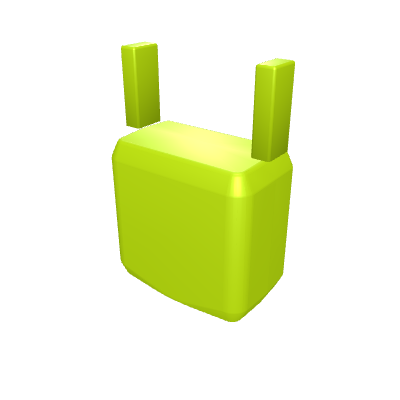<br><code>fetch_robot</code><br><sub>parallel_2f</sub></td>
    <td align="center">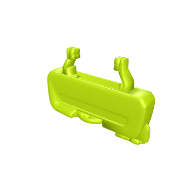<br><code>franka_panda</code><br><sub>parallel_2f</sub></td>
  </tr>
  <tr>
    <td align="center">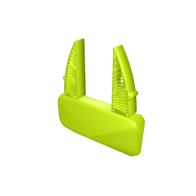<br><code>franka_umi</code><br><sub>parallel_2f</sub></td>
    <td align="center">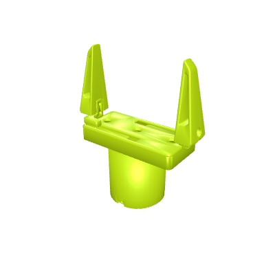<br><code>galaxea_g1</code><br><sub>revolute_2f</sub></td>
    <td align="center">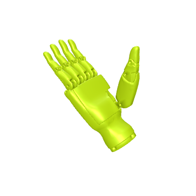<br><code>inspire_hand</code><br><sub>revolute_3f</sub></td>
    <td align="center">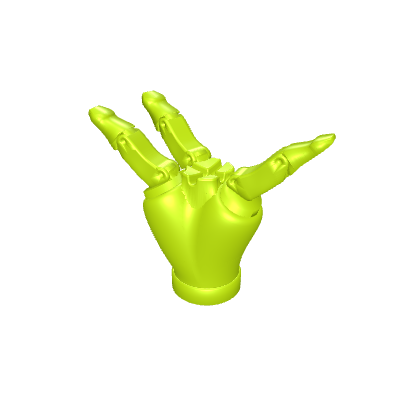<br><code>kinova_3f</code><br><sub>revolute_3f</sub></td>
    <td align="center">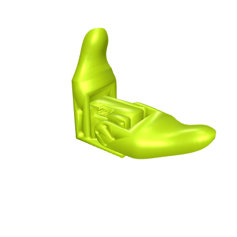<br><code>koch_hand</code><br><sub>revolute_2f</sub></td>
    <td align="center">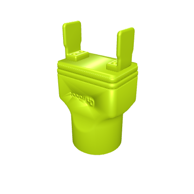<br><code>onrobot_2FG7</code><br><sub>parallel_2f</sub></td>
    <td align="center">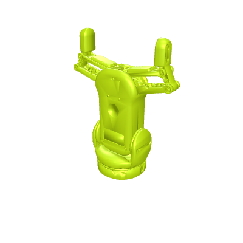<br><code>onrobot_RG2</code><br><sub>revolute_2f</sub></td>
    <td align="center">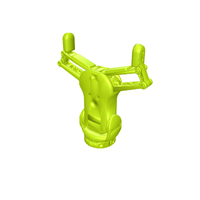<br><code>onrobot_RG6</code><br><sub>revolute_2f</sub></td>
  </tr>
  <tr>
    <td align="center">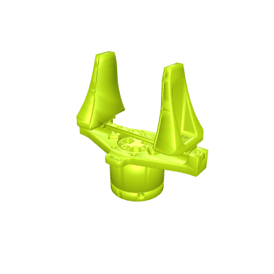<br><code>piper_hand</code><br><sub>revolute_2f</sub></td>
    <td align="center">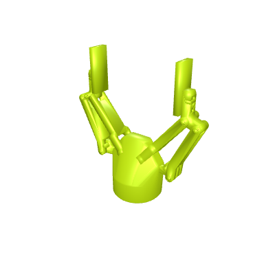<br><code>robotiq_2f_140</code><br><sub>revolute_2f</sub></td>
    <td align="center">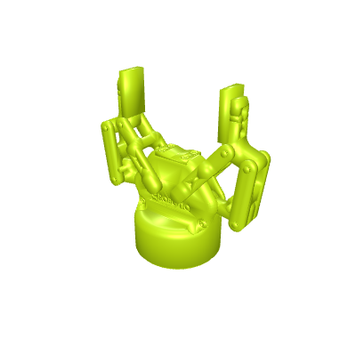<br><code>robotiq_2f_85</code><br><sub>revolute_2f</sub></td>
    <td align="center">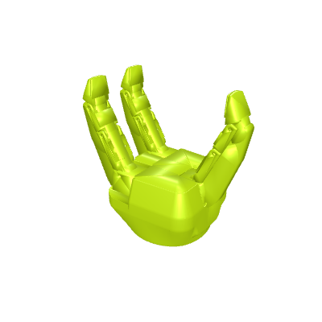<br><code>robotiq_3f</code><br><sub>revolute_3f</sub></td>
    <td align="center">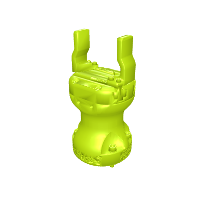<br><code>robotiq_hande</code><br><sub>parallel_2f</sub></td>
    <td align="center">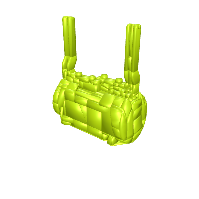<br><code>sawyer_hand</code><br><sub>parallel_2f</sub></td>
    <td align="center">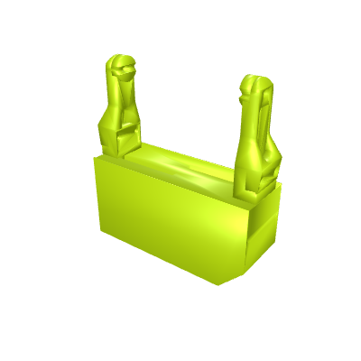<br><code>schunk_wsg50</code><br><sub>parallel_2f</sub></td>
    <td align="center">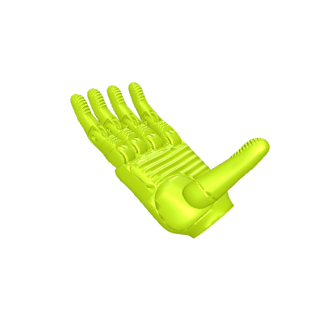<br><code>surge_hand</code><br><sub>revolute_3f</sub></td>
  </tr>
  <tr>
    <td align="center">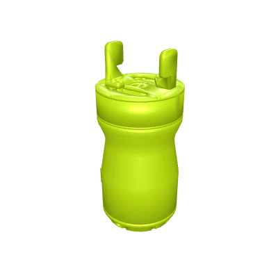<br><code>tesollo_delto2f</code><br><sub>revolute_2f</sub></td>
    <td align="center">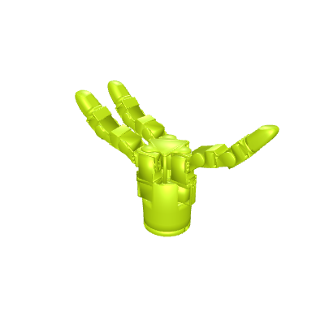<br><code>tesollo_delto3f</code><br><sub>revolute_3f</sub></td>
    <td align="center">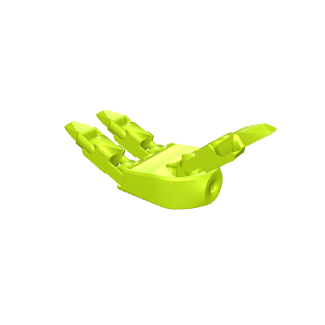<br><code>unitree_g1</code><br><sub>revolute_2f</sub></td>
    <td align="center">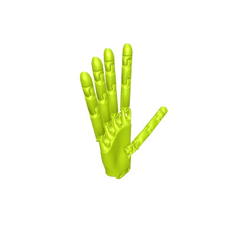<br><code>wuji</code><br><sub>revolute_3f</sub></td>
    <td align="center">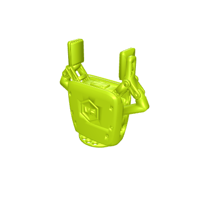<br><code>xarm_hand</code><br><sub>revolute_2f</sub></td>
  </tr>
</table>

## Installation

```bash
pip install -e .
```

Or directly from the repository:
```bash
pip install -e git+ssh://git@gitlab-master.nvidia.com:12051/rays2torques/graspgen/gripper_descriptions.git#egg=gripper_descriptions
```

## Usage

```python
import gripper_descriptions

# Get path to all gripper assets
assets_path = gripper_descriptions.get_assets_path()

# Get path to a specific gripper
gripper_path = gripper_descriptions.get_gripper_path("robotiq_2f_85")

# List all available grippers
print(gripper_descriptions.list_grippers())
print(gripper_descriptions.AVAILABLE_GRIPPERS)
```

### With GraspGenX

Once installed, GraspGenX automatically discovers gripper assets from this package:

```python
from graspgenx.x_grippers import get_gripper_info
import gripper_descriptions

gripper = get_gripper_info(gripper_descriptions.get_assets_path(), "robotiq_2f_85")
```

### Visualization

```bash
# Visualize a single gripper
python -m gripper_descriptions.scripts.vis_gripper --gripper robotiq_2f_85

# Animate open/close
python -m gripper_descriptions.scripts.vis_gripper --gripper robotiq_2f_85 --animate

# Show all grippers in a grid
python -m gripper_descriptions.scripts.vis_all_grippers

# List available grippers
python -m gripper_descriptions.scripts.vis_gripper --list-grippers
```

## Asset Structure

Each gripper directory contains:

| File | Description |
|------|-------------|
| `gripper.urdf` | URDF with mesh paths relative to `meshes/` |
| `meshes/` | STL/OBJ mesh files referenced by the URDF |
| `config.json` | Joint configs (open/close), fingertip, sweep volume, type |
| `vis_mesh.obj` | Merged visual mesh (open configuration) |
| `coll_mesh.obj` | Merged collision mesh (open configuration) |
| `points.json` | Surface point clouds (open/close, 10500 pts each) |
| `selected_pts.json` | Inner-surface point clouds (open/mid/close) |
| `tsdf.npy` | Truncated signed distance fields |
| `proc_gripper_only_pointnet_vae_repr.json` | PointNet VAE embedding (64-D) |

## License

NVIDIA Corporation. See individual gripper directories for source attribution.
